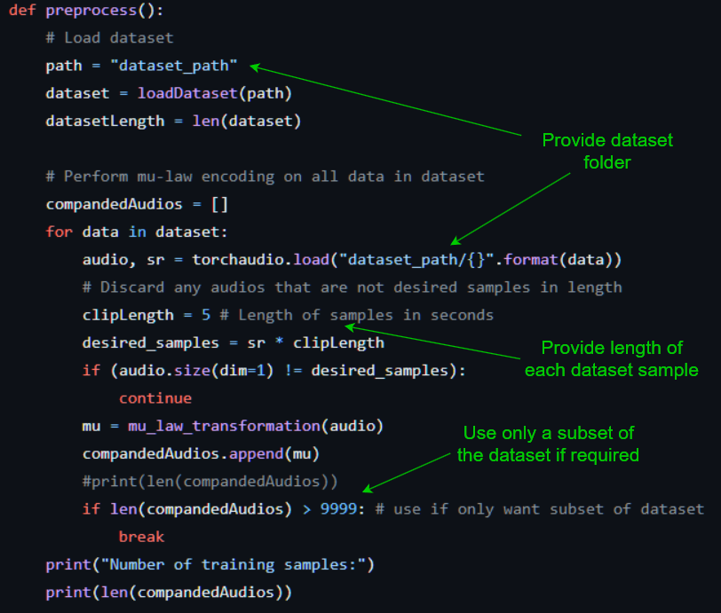

# WaveNet

This repository implements the WaveNet generation model for raw audio, introduced by van den Oord et al. in their [original paper](https://arxiv.org/abs/1609.03499). Its primary use here is to generate classical piano music.

## Training the model

Training of the WaveNet model can be done through the class `train.py`.

Steps for training:

1) Declare the dataset to be used for training (training and validation in a single folder) inside `preprocess.py`:

Note that this dataset folder MUST contain training examples that are all of the exact same length in digital samples. It is highly recommended to utilise the `splitaudio` program on your dataset if it does not yet satisfy this requirement.
Training labels will be created automatically from the provided dataset.

2) Configure the WaveNet model parameters inside `Wavenet.py`:

3) Set appropriate parameters for training within `train.py`:

4) Specify the desired learning rate and number of epochs for training inside `main.py`:

Once all the above steps have been completed, training can be initialised by running the Python script `main.py`.

Models will be saved to a .pth with the name you specified. Loss and learning rate plots will also be saved for future reference.

## Generating with the model

Lorem ipsum.

