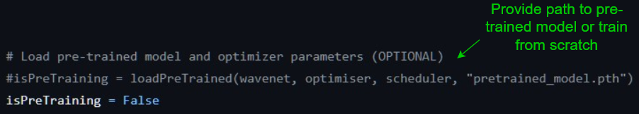

# WaveNet

This repository implements the WaveNet generation model for raw audio, introduced by van den Oord et al. in their [original paper](https://arxiv.org/abs/1609.03499). Its primary use here is to generate classical piano music. For a detailed explanation of the underlying architecture as well as generation experiments, check out the [paper](Creating_compelling_music_through_deep_convolutional_networks.pdf).

## Training the model

Training of the WaveNet model can be done through the script `train.py`.

Steps for training:

1) Declare the dataset to be used for training (training and validation in a single folder) inside `preprocess.py`:

Note that this dataset folder MUST contain training examples that are all of the exact same length in digital samples. It is highly recommended to utilise the `splitaudio` program on your dataset if it does not yet satisfy this requirement.
Training labels will be created automatically from the provided dataset.

Training/validation split can be provided, also with an optional seed to ensure that the training/validation dataset split is the same every training cycle (useful for example if training in a staggered manner):

2) Configure the WaveNet model parameters inside `Wavenet.py`:

The two most important parameters here are `layers` and `stacks` - together they determine the receptive field of the network. The higher the number of stacks and layers, the more memory is used when training the model, so proceed with care when choosing these values. For recommended values please consult the [paper](Creating_compelling_music_through_deep_convolutional_networks.pdf). The other parameters, especially `classes`, should not be altered unless you really know what you are doing.

3) Set appropriate parameters for training within `train.py`:

If pre-training you must get the last epoch to resume training from:

The model and all its parameters will need to be saved to a specified .pth (or other) file:

Loss and learning rate plots will also be saved:

4) Specify the desired learning rate and number of epochs for training inside `main.py`:

Once all the above steps have been completed, training can be initialised by running the Python script `main.py`.

Models will be saved to a .pth file with the name you specified. Loss and learning rate plots will also be saved for future reference.

## Generating with the model

Once models have been trained, we can use them to generate audio. This is done using the script `generate.py`.

Steps for generating:

1) Define the model you want to use for generation:

2) Determine the generation parameters: generation type (unique or assisted/seeding) and length of generation:

Generated samples will be saved to a wav file once completed.

3) Declare the desired generation sample rate in `postprocess.py`. This should be the same as the rate the data from the loaded model was trained on.

Once all the above steps have been completed, generation can be initialised by running the Python script `generate.py`.

The datasets used for our generation experiments are outlined in the [paper](Creating_compelling_music_through_deep_convolutional_networks.pdf). Please consult this for examples of datasets you may like to use.

Happy generating!